## L'autorité dans Anarchy

_Les constructions de l'autorité dans un dispositif de production littéraire collaborative&nbsp;: le cas de l'expérience transmédia Anarchy.fr_

&nbsp;

&nbsp;

<small>Nicolas Sauret (CRC sur les écritures numériques - UdeM)
  Ariane Mayer (UTC & Iri, Centre Pompidou) - 
Figures et expériences de l'autorité en littérature 3e colloque étudiant du Dllf - Udem - 19 & 20 janvier 2017</small>

===

Nous avons déjà présenté cette étude à l'Udem lors du Colloque «Editorialisation de l'auteur» en mai dernier, mais je reprends ici la présentation faite à Paris en mars dernier au colloque «Mediations informatisées de l'autorité».

%%%%%%%%%%%%%%%%%%%%%%%%%%%%%%%%%%%%%%%%%%%%%

### Qu'est ce qu'Anarchy ?

* **Expérience transmédia** de France Télévisions
* 6 semaines (fin 2014)
* **Une fiction** : la France sort de l'euro
* **L'univers** : 1 site d'actualités alimenté par la Rédaction et les internautes
* **Un jeu, 3 modes de contributions** :
  * cadavre exquis : _les Héros de la Rédaction_
  * flux d'actualités : _le Fioul_
  * contributions littéraires : _«&nbsp;Vos personnages&nbsp;»_

===
Anarchy est une expérience transmédia de France Télévisions qui s’est déroulée fin 2014 pendant 6 semaines.
Le point de départ de l’expérience est l’annonce par Francois Hollande dans la nuit du 29 au 30 octobre 2014 de **la sortie de la France de l’euro et du retour au franc**. Le président, dans son annonce, invite les français à se montrer solidaires et courageux, puisque les retraits bancaires seront limités dans les semaines suivantes **à 40 euros par semaine et par carte bancaire**.

§§§§§§§§§§§§§§§§§§§§§§§§§§§§§§§§§§§§§§§§§§§§§

  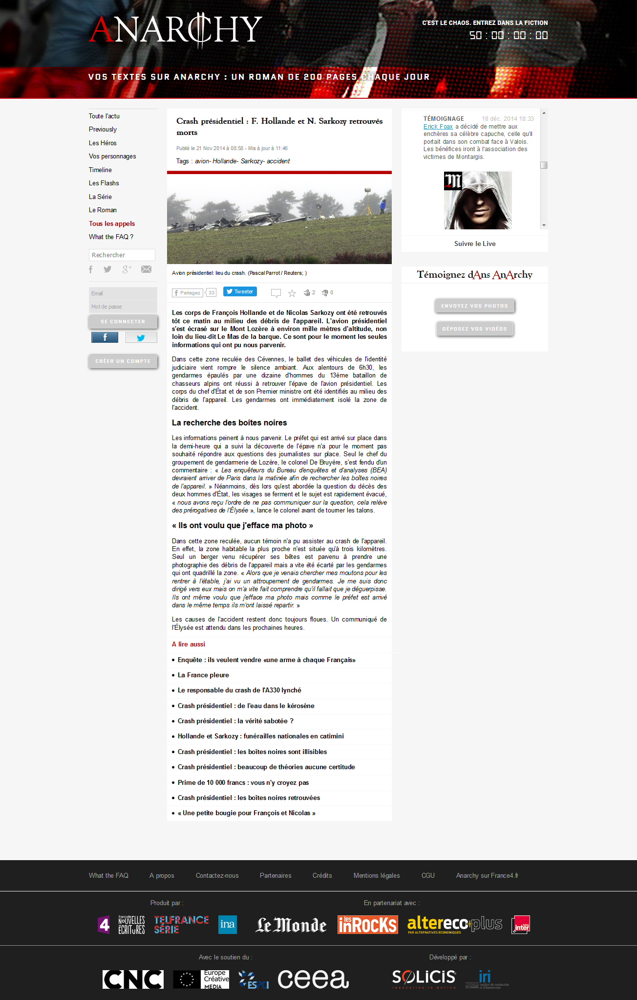

===
L’univers transmédia d’Anarchy est composé d’un site d’actualité, qui raconte au jour le jour cette France parallèle, d’une application mobile, d’une série télévisée, plus d’un certain nombre de relais médiatiques à travers des chroniques fictives sur France Inter et le monde économie, etc.

Le site d’actualité constitue réellement le cœur de l’expérience. Il est alimenté par la Rédaction, une petite équipe d’une dizaine de journalistes. La Rédaction s’évertuent à créer de toutes pièces une information fictive. Il est aussi alimenté par les internautes qui vont rapidement devenir la meilleure source d’inspiration pour la Rédaction.

§§§§§§§§§§§§§§§§§§§§§§§§§§§§§§§§§§§§§§§§§§§§§
### Qu'est ce qu'Anarchy ?

* **Expérience transmédia** de France Télévisions
* 6 semaines (fin 2014)
* **Une fiction** : la France sort de l'euro
* **L'univers** : 1 site d'actualités alimenté par la Rédaction et les internautes
* **Un jeu, 3 modes de contributions** :
  * cadavre exquis : _les Héros de la Rédaction_
  * flux d'actualités : _le Fioul_
  * contributions littéraires : _«&nbsp;Vos personnages&nbsp;»_

===
Anarchy est également un jeu, avec des points à gagner et un classement des internautes qui ont à disposition pour jouer 3 modes de contributions :

**Le cadavre exquis littéraire** de 6 personnages fictifs imaginés par la Rédaction, et dont l’histoire quotidienne dans Anarchy est sélectionnée parmi les propositions des internautes. Sur le modèle des ateliers d’écriture, leur production littéraire doit suivre des contraintes précises,

**Le flux d’actualité** : qui se présente comme les live que vous trouvez sur les sites d’informations : les internautes sont invités à témoigner sur une situation donnée, à envoyer leurs vidéos, photos, scoops de première main, etc.

**Les personnages** qui a été un des moteurs de jeu les plus intéressant et les plus dynamique : chaque internaute peut créer entre un et huit personnages et écrire leur histoire au travers de billets, de contributions littéraires, venant alimenter le mur du personnage, comme un profil facebook.

§§§§§§§§§§§§§§§§§§§§§§§§§§§§§§§§§§§§§§§§§§§§§
### Notre corpus : _&laquo;Vos personnages&raquo;_

<ul>
  <li>398 auteurs actifs (sur 2633 inscrits)</li>
  <li>1212 personnages</li>
  <li>11280 contributions originales</li>
  <li>soit l'équivalent d'un roman de 200 pages par jour.</li>
</ul>

  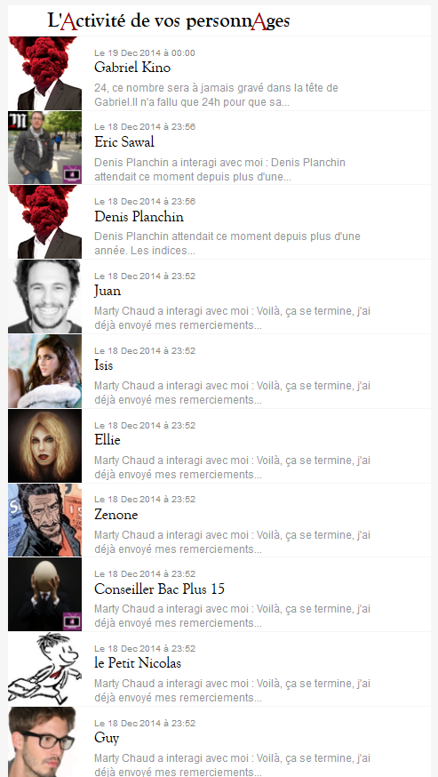

===
Quelques chiffres sur ces personnages : 398 auteurs actifs, 1212 personnages créés, 11280 contributions originales, soit l’équivalent d’un roman de 200 pages par jour. Et qui a constitué finalement le cœur de notre corpus de recherche.

Il s'agit en fait d'une oeuvre littéraire collective. C'est ce corpus que nous avons exploré pour questionner la production de l'autorité.

§§§§§§§§§§§§§§§§§§§§§§§§§§§§§§§§§§§§§§§§§§§§§

  Profil de l'_auteur_ Ndish
  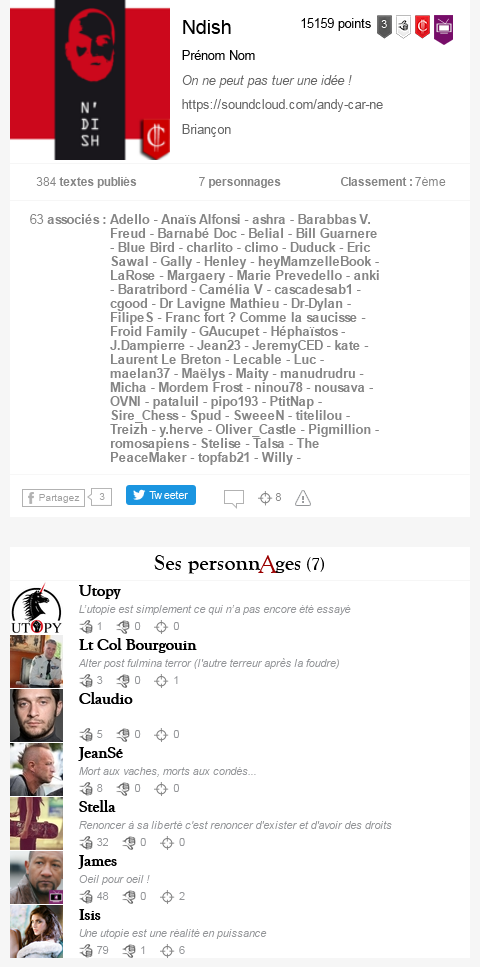

  <i class="fa fa-arrow-right"></i>

  Profil du _personnage_ Isis
  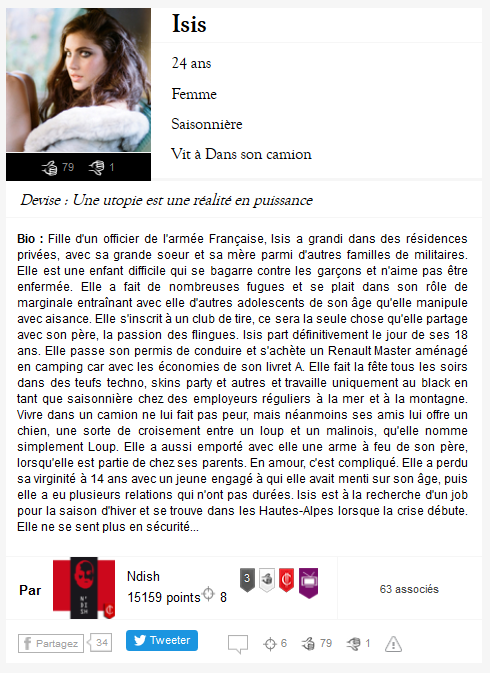

===
Pour clarifier les différents statuts impliqués, nous avons donc les personnes réelles qui s'inscrivent sur la plateforme avec un nom d'auteur. Cet auteur possède un profil auquel sont attachés les différents personnages créé par l'auteur.

Chaque personnage possède également son profil : on a là en quelque sorte la bible narrative du personnage, pratique que l'on retrouve dans les fans-fictions.

§§§§§§§§§§§§§§§§§§§§§§§§§§§§§§§§§§§§§§§§§§§§§

  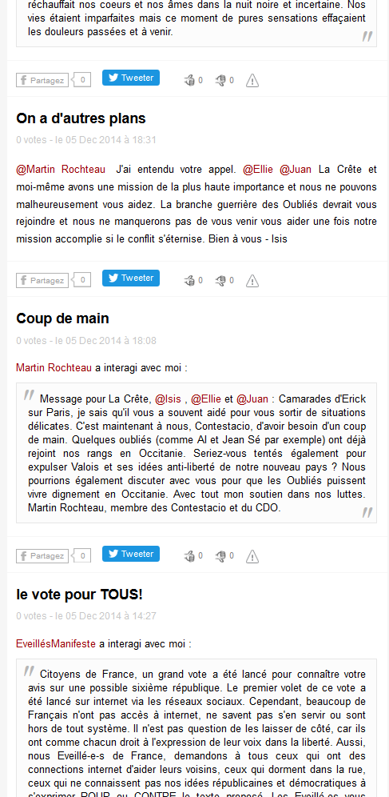

  <i class="fa fa-arrow-right"></i>

  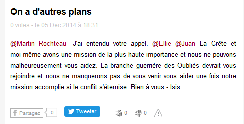

===

Enfin, les auteurs rédigent pour leurs personnages des posts, des contributions littéraires, racontant l'histoire du personnage. Ici les formes d'écritures étaient absolument libres, on a vu des post à la première personne, à la troisième, on a vu de la prose, de la rime, des messages très court type micro-blogging, mais aussi des textes extrêment élaborés et bien écrit.

§§§§§§§§§§§§§§§§§§§§§§§§§§§§§§§§§§§§§§§§§§§§§

L'auteur mentionne _@Laura_ dans son post.

===
Seules quelques règles du jeu s'appliquaient : Je vous cite la plus importante et la plus déterminante pour la suite de notre étude : la possibilité de mentionner d'autres personnages, sur le mode de la mention twitter @Laura par exemple. Cette mention n'était possible que si les auteurs s'étaient préalablement associés mutuellement, un équivalent d'une déclaration d'amitié sur facebook, ou encore d'un suivi mutuel sur Twitter.

Ce jeu d'association et de mention a bien évidemment entrainé des interactions entre joueurs et généré des formes d'écritures spécifiques. C'est à partir de ces mentions que nous avons tenté d'identifier les différentes manifestations de l'autorité entre auteurs, mais aussi entre la Rédaction et les auteurs, en considérant notamment les dynamiques de collaborations qui se sont naturellement manifestées.

%%%%%%%%%%%%%%%%%%%%%%%%%%%%%%%%%%%%%%%%%%%%%

## Concepts

&nbsp;

Spécificités de notre approche de l'autorité :  
&nbsp;

1. Caractère _littéraire_ du corpus  
2. Caractère *stratégique* de la constitution de l'autorité

===

Un mot rapide sur notre approche conceptuelle de l'autorité dans le cas Anarchy.

Il s'agissait de prendre en compte deux spécificités de notre corpus :

_l'autorité faisant appel à un certain nombre de notions connexes comme l’influence, la visibilité, la notoriété (ou réputation), ou encore la légitimité._

§§§§§§§§§§§§§§§§§§§§§§§§§§§§§§§§§§§§§§§§§§§§§

#### 1. Caractère _littéraire_

&nbsp;

Une autorité qui s'exerce sur deux types de récits et d'acteurs  

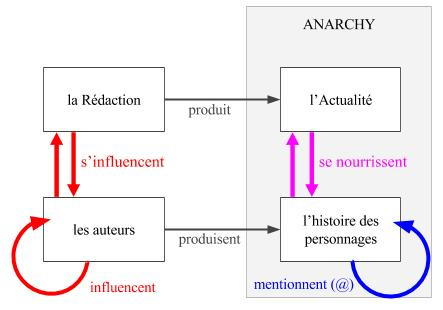

<small>Figure : _Circulation de l'influence dans Anarchy_</small>

===
Le caractère _littéraire_ de notre corpus : C'est un récit, et nous avons cherché à mettre en évidence la manière dont les auteurs ont influencé ce récit. Il s'agissait alors d'examiner l'autorité exprimée à l'égard de deux types d'acteurs : la rédaction et les joueurs. Et de deux types d'énocés : le récit-cadre et les règles du jeu fixé par les concepteur d'Anarchy.

<!-- on a cherché mettre en évidence la manière dont les auteurs vont influencer de manière décisive le cours du récit Anarchy. Cela suppose notamment d’examiner l’autorité telle qu’elle s’exprime à l’égard de deux types d’acteurs et deux types d’énoncés (le récit des autres joueurs d’une part, et d’autre part le récit-cadre et les règles du jeu fixés par la Rédaction).

(à travers leurs personnages, mais aussi leurs techniques et positionnements au sein du jeu),  -->

§§§§§§§§§§§§§§§§§§§§§§§§§§§§§§§§§§§§§§§§§§§§§

#### 2. Caractère *stratégique*

&nbsp;

L'autorité comme circulation, dynamique et processuelle

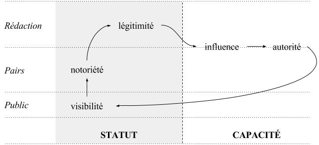

<small>Figure : _Circulation de l'autorité_</small>

===

Par ailleurs, le caractère stratégique de la construction de l’autorité. Il a s'agit comprendre l'articulation entre autorité et des notions connexes comme la visibilité, la notoriété, la légitimité, l'influence et de reconnaitre l'autorité non pas comme une donnée statique, mais comme une circulation où ces notions s'imbriquent étroitement et fonctionnent comme des conditions de possibilité les unes des autres. Le jeu d'inclusion et de dépendance dessine le processus qu'est l'autorité.

---
Dès lors, dans le contexte de la fiction collaborative Anarchy, nous pouvons penser la circulation à l’œuvre dans les stratégies de constitution de l’autorité selon ce schéma (slide). La distinction entre les notions connexes qu’on a mentionnées peut se lire du point de vue de leur relation (la visibilité est une condition de possibilité de la notoriété, qui en est une pour la légitimité, qui en est une pour l’influence), de leur statut (visibilité, notoriété et légitimité sont des états de fait là où l’influence est une capacité), et de leur cible (le public, les pairs, la Rédaction). Notre problématique théorique est de savoir, compte tenu ces précisions : quelles sont les relations entre écriture fictionnelle, auctorialité et autorité au sein d’un dispositif littéraire numérique participatif ?

%%%%%%%%%%%%%%%%%%%%%%%%%%%%%%%%%%%%%%%%%%%%%
### Modèle : triple approche
&nbsp; 

<table class="tg8">
  <tr>
    <th class="tg-6l08">1</th>
    <th class="tg-6l08">2</th>
    <th class="tg-6l08">3</th>
  </tr>
  <tr>
    <td class="tg-6l08">Approche quantitative</td>
    <td class="tg-6l09">Approche qualitative</td>
    <td class="tg-6l08">Approche organisationelle</td>
  </tr>
  <tr>
    <td class="tg-6l08"><i class="fa fa-arrow-down"></i></td>
    <td class="tg-6l09"><i class="fa fa-arrow-down"></i></td>
    <td class="tg-6l08"><i class="fa fa-arrow-down"></i></td>
  </tr>
  <tr>
    <td class="tg-6l08">autorité topologique</td>
    <td class="tg-6l09">autorité narrative</td>
    <td class="tg-6l08">autorité dispositive</td>
  </tr>
</table>

%%%%%%%%%%%%%%%%%%%%%%%%%%%%%%%%%%%%%%%%%%%%%
## 1. Approche topologique

===

§§§§§§§§§§§§§§§§§§§§§§§§§§§§§§§§§§§§§§§§§§§§§
### Description de l'approche

&nbsp;

  

    
    <!-- <small>Erick Foax @Laura</small> -->
  

  

    <i class="fa fa-arrow-right"></i>
  

  

    
  <table class="tg6">
    <tr>
      <th class="tg-031e"></th>
      <th class="tg-s6z2">Erick Foax</th>
      <th class="tg-s6z2">Laura</th>
    </tr>
    <tr>
      <td class="tg-031e">Erick Foax</td>
      <td class="tg-s6z2">-</td>
      <td class="tg-s6z2">1</td>
    </tr>
    <tr>
      <td class="tg-031e">Laura</td>
      <td class="tg-s6z2">0</td>
      <td class="tg-s6z2">-</td>
    </tr>
  </table>
  

  

    <i class="fa fa-arrow-right"></i>
  

  

    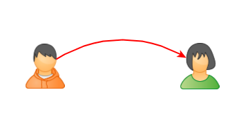
  

    

===
**La première approche a consisté à faire une analyse du réseau social des personnages créés par les internautes**. Ce réseau est généré à partir des mentions intégrées dans les contributions littéraires des joueurs. Un script nous a permis de comptabiliser toutes les mentions d'un personnage à l'autre, générant une matrice carrée d'ordre 1212, correspondant au nombre de personnages.

§§§§§§§§§§§§§§§§§§§§§§§§§§§§§§§§§§§§§§§§§§§§§

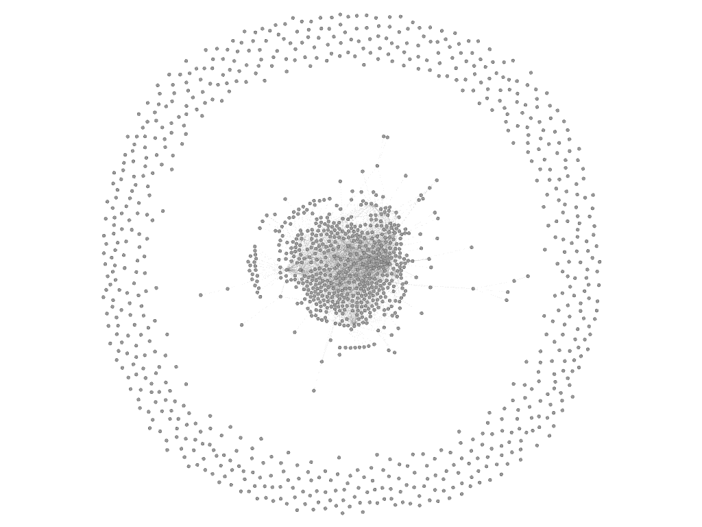

<small>Figure : _Spatialisation générale avec personnages hors-réseau_</small>

===
**Je n'ai pas malheureusement pas le temps de développer, mais nous avons spatialisé ce réseau, et effectué des calculs statistiques dessus.**

A partir de cette matrice, nous avons utilisé le logiciel de spatialisation de réseau, Gephi, pour produire des représentations spatiales et effectuer un certain nombre de calcul statistiques sur le corpus.

Ici, nous identifions très bien à la périphérie, ces personnages hors-réseau, dont l’histoire dans Anarchy a manifestement évoluée sans interaction avec d’autres personnages.

§§§§§§§§§§§§§§§§§§§§§§§§§§§§§§§§§§§§§§§§§§§§§

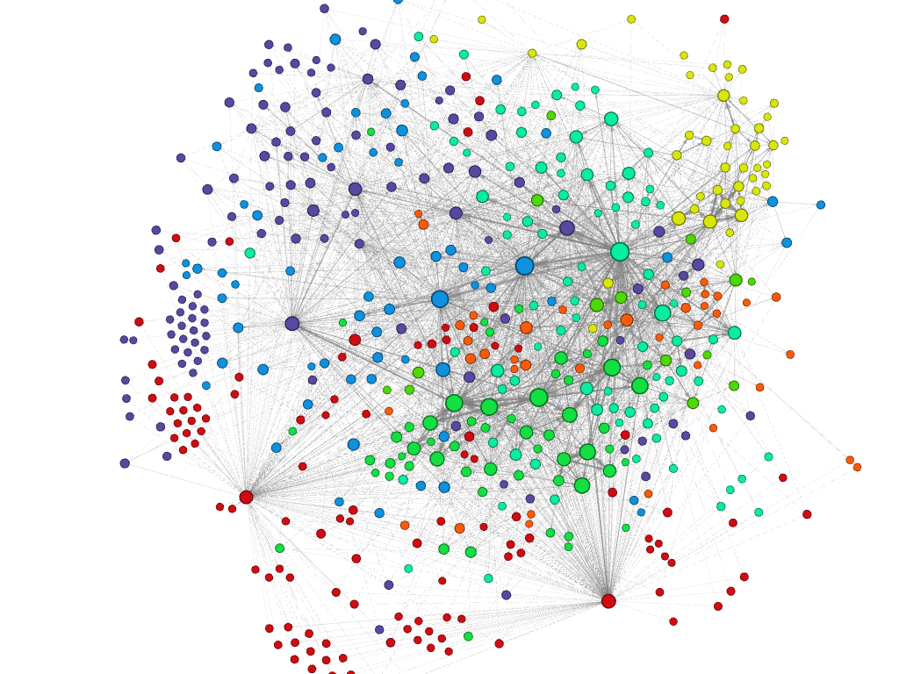

<small>Figure : _Mise en évidence des 8 communautés de personnages_ (modularité = 0,357) </small>

===
**identifié des communautés de joueurs...**
Après nettoyage de cette périphérie, nous obtenons une graphe social de 514 noeuds (personnages), sur lequel un calcul de modularité nous permet d'identifier 8 communautés qui relève en fait à la fois de la proximité narrative des personnages et collaborative de leurs auteurs.

§§§§§§§§§§§§§§§§§§§§§§§§§§§§§§§§§§§§§§§§§§§§§

<small>Figure : _Mise en évidence des 3 communautés principales_</small>

===
Ici, nous avons isolé les 3 principales communautés pour visualiser leurs relations. Principales au sens où elles rassemblent les personnages les plus influents. Ces personnages influents sont ceux qui se dégagent intuitivement à la lecture de l'Actualité d'Anarchy, ou encore à posteriori à la lecture du livre de Marion Guénard, une des journalistes de la Rédaction, qui a été missionné par FTV pour publier son expérience à la Rédaction.

§§§§§§§§§§§§§§§§§§§§§§§§§§§§§§§§§§§§§§§§§§§§§

  
  <table class="tg3">
    <tr>
      <th class="tg-031e">Personnage</th>
      <th class="tg-baqh">Centralité (Eigenvector)</th>
    </tr>
    <tr>
      <td class="tg-b7b8">France BN</td>
      <td class="tg-dzk6">1</td>
    </tr>
    <tr>
      <td class="tg-yw4l">FranceIndé</td>
      <td class="tg-baqh">0,961</td>
    </tr>
    <tr>
      <td class="tg-b7b8">Guy</td>
      <td class="tg-dzk6">0,941</td>
    </tr>
    <tr>
      <td class="tg-yw4l">Charlito</td>
      <td class="tg-baqh">0,869</td>
    </tr>
    <tr>
      <td class="tg-b7b8">EveillésManifeste</td>
      <td class="tg-dzk6">0,850</td>
    </tr>
    <tr>
      <td class="tg-yw4l">Victor</td>
      <td class="tg-baqh">0,847</td>
    </tr>
    <tr>
      <td class="tg-b7b8">Eric Sawal</td>
      <td class="tg-dzk6">0,847</td>
    </tr>
    <tr>
      <td class="tg-yw4l">Erick Foax</td>
      <td class="tg-baqh">0,797</td>
    </tr>
    <tr>
      <td class="tg-b7b8">Charles Vennec</td>
      <td class="tg-dzk6">0,789</td>
    </tr>
    <tr>
      <td class="tg-yw4l">Isis</td>
      <td class="tg-baqh">0,768</td>
    </tr>
    <tr>
      <td class="tg-b7b8">La Crête</td>
      <td class="tg-dzk6">0,722</td>
    </tr>
  </table>

<small>Figure : _Mise en évidence de la centralité de vecteur propre des personnages_</small>

===
**nous avons notamment pu mesurer l'influence des uns et des autres grâce à ce calcul de la centralité de vecteur propre. Mais je saute à la conclusion:**

Or, il est intéressant de remarquer que l'influence de ces personnages, identifiée d’abord en parcourant le site et à la lecture du corpus, nous est largement confirmée par cette mesure de centralité de vecteur propre. La centralité de vecteur propre est calculée à partir des mentions entrantes et sortantes d'un noeud et indexée sur le degré de connectivité aux noeuds influents. Autrement dit, un lien vers ou depuis un personnage déjà influent sera de plus forte valeur qu'un lien vers un personnage inconnu.

§§§§§§§§§§§§§§§§§§§§§§§§§§§§§§§§§§§§§§§§§§§§§
### Autorité topologique

&nbsp;

> l'influence d'un personnage sur le reste du réseau.

===
Cette approche quantitative met en évidence les propriétés topologiques du réseau en matérialisant l'espace narratif dans lequel évoluent les personnages d'Anarchy. L'autorité topologique témoigne ainsi de l'effet d'influence d'un personnage sur le reste du réseau.

§§§§§§§§§§§§§§§§§§§§§§§§§§§§§§§§§§§§§§§§§§§§§
### Conclusion

&nbsp;

<i class="fa fa-arrow-right"></i> autorité ou mise en évidence de l'autorité ?

===
Or notre corpus nous laisse penser que cette autorité topologique est davantage un état de fait. finalement, c'est une simple représentation de l'autorité de tel ou tel personnage. Ce qui va un peu à l’encontre de l’étude des réseaux sociaux. En effet, les réseaux sociaux s'inscrivent dans un temps long et dans un espace social plus large. Du coup, les effets de réseaux et les algorithmes de recommandation produisent réellement des autorités, des dynamiques d'influence, etc.

Dans notre cas, cette autorité topologique est plutôt une conséquence des deux autres volets que nous avons exploré.

%%%%%%%%%%%%%%%%%%%%%%%%%%%%%%%%%%%%%%%%%%%%%
## 2. Approche narrative

===
Après l’analyse quantitative nous avons mené une deuxième approche, qualitative : en regardant la dimension narrative du corpus et la construction d’une influence des joueurs sur le récit des autres et sur le récit-cadre de la Rédaction.

§§§§§§§§§§§§§§§§§§§§§§§§§§§§§§§§§§§§§§§§§§§§§
### Description de l'approche

&nbsp;

<i class="fa fa-arrow-right"></i> Le cas du personnage La Crête (auteur : N'Dish)  
<i class="fa fa-arrow-right"></i> &Eacute;chantillon des contributions La Crête  
<i class="fa fa-arrow-right"></i> Tableau comparatif La Crête/Actualités

===

Pour ce faire, on a choisi de se concentrer sur un personnage particulier : La Crête, écrit par NDish. La Crête est le leader des Oubliés, un groupe de personnages anarcho-révolutionnaires). NDish ne fait pas partie du trio gagnant (il arrive en 7ème position), mais il est intéressant pour deux raisons :

1. ses multiples initiatives narratives ont connu de larges répercussions (attentats, sièges, assauts des forces de l’ordre),
2. son bras de fer avec la Rédaction.

<!-- (résultat notamment de la reconnaissance « populaire » et des relations qu'il a entretenu avec « l’institution »). -->

Pour analyser les stratégies de N’Dish pour accroître son influence, nous nous sommes appuyés sur deux sous-corpus qu’on a mis en regard l’un de l’autre :  

§§§§§§§§§§§§§§§§§§§§§§§§§§§§§§§§§§§§§§§§§§§§§

<table class="tg4">
  <tr>
    <th class="tg-yw4l">ID</th>
    <th class="tg-yw4l">Date</th>
    <th class="tg-yw4l">Personnage</th>
    <th class="tg-yw4l">Auteur</th>
    <th class="tg-yw4l">Titre</th>
    <th class="tg-yw4l">Evénements</th>
    <th class="tg-yw4l">Adresses</th>
    <th class="tg-yw4l">Remarques</th>
  </tr>
  <tr>
    <td class="tg-kjho">7735</td>
    <td class="tg-kjho">2014-11-21 14:45:15</td>
    <td class="tg-kjho">La Crête</td>
    <td class="tg-kjho">Ndish</td>
    <td class="tg-kjho">A l'attaaaaaaaaaaaque !</td>
    <td class="tg-kjho">Apprend qu'Isis est en prison;critique les Eveillés;Rencontre Eric Sawal qu'il intègre à son armée</td>
    <td class="tg-kjho">Victor; Charlito; Guy; Lilou; Eric Sawal</td>
    <td class="tg-kjho">La Crête étend son réseau</td>
  </tr>
  <tr>
    <td class="tg-3we0">7867</td>
    <td class="tg-3we0">2014-11-21 13:56:56</td>
    <td class="tg-3we0">eric-sawal</td>
    <td class="tg-3we0">Eric Sawal</td>
    <td class="tg-3we0">21 Nov - Isis en taule</td>
    <td class="tg-3we0">S'adresse à La Crête: vient d'apprendre que les amis de la Crête Ellie, Isis et Juan sont en prison; se dit prêt à se joindre à lui pour les libérer</td>
    <td class="tg-3we0">La Crête; Juan; Isis; Ellie</td>
    <td class="tg-3we0"></td>
  </tr>
  <tr>
    <td class="tg-3we0">7878</td>
    <td class="tg-3we0">2014-11-21 15:09:33</td>
    <td class="tg-3we0">eric-sawal</td>
    <td class="tg-3we0">Eric Sawal</td>
    <td class="tg-3we0">21 Nov - En route avec La Crête</td>
    <td class="tg-3we0">Rejoint La Crête dans son plan de sauvetage d'Isis, Juan et Ellie; se dit prêt à mourir</td>
    <td class="tg-3we0">La Crête; Juan; Isis; Ellie</td>
    <td class="tg-3we0"></td>
  </tr>
  <!-- <tr>
    <td class="tg-3we0">7898</td>
    <td class="tg-3we0">2014-11-21 18:28:18</td>
    <td class="tg-3we0">guy</td>
    <td class="tg-3we0">Gally</td>
    <td class="tg-3we0">la constituante</td>
    <td class="tg-3we0">Affirme au nom des éveillés des réflexions sur le programme politique qui permettra de sortir de la crise et les moyens de l'atteindre. Critique ceux qui posent des bombes comme La Crête.</td>
    <td class="tg-3we0">Un Petit Rien; Bias de Priène; Gritusse; Tiphaine; Victor; Charlito; Auguste Baboeuf; Stelise; Alex V.; Capucine Cher; Marianne Guérin; Parti européiste; justin tresor; Liza Papanov; Lilou; Tous Ensemble; Walter</td>
    <td class="tg-3we0">La Crête critiqué pour ses actions violentes</td>
  </tr>
  <tr>
    <td class="tg-3we0">7900</td>
    <td class="tg-3we0">2014-11-21 18:50:01</td>
    <td class="tg-3we0">victor</td>
    <td class="tg-3we0">climo</td>
    <td class="tg-3we0">La Crète</td>
    <td class="tg-3we0">Evoque la même scène que Gally au post précédent: La Crête en punk-à-chien qui demande qui est le taulier ici, Victor répond qu'il n'y a pas de chef</td>
    <td class="tg-3we0">Guy; La Crête</td>
    <td class="tg-3we0"></td>
  </tr> -->
  <tr>
    <td class="tg-kjho">7975</td>
    <td class="tg-kjho">2014-11-22 12:08:05</td>
    <td class="tg-kjho">La Crête</td>
    <td class="tg-kjho">Ndish</td>
    <td class="tg-kjho">SVP</td>
    <td class="tg-kjho">S'adresse à Eric Sawal sur la stratégie pour leur assaut du commissariat de Boulogne B. visant à libérer leurs copains</td>
    <td class="tg-kjho">Eric Sawal</td>
    <td class="tg-kjho">La Crête force de proposition: soumet directement à Eric Sawal un plan.</td>
  </tr>
  <tr>
    <td class="tg-3we0">8031</td>
    <td class="tg-3we0">2014-11-22 14:52:28</td>
    <td class="tg-3we0">eric-sawal</td>
    <td class="tg-3we0">Eric Sawal</td>
    <td class="tg-3we0">Le plan de La Crête</td>
    <td class="tg-3we0">Eric se dit d'accord avec le plan de La Crête mais il faut éviter au maximum la violence</td>
    <td class="tg-3we0">La Crête</td>
    <td class="tg-3we0">Atteste de l'influence de La Crête au niveau narratif: plan accepté et Eric suit son initiative</td>
  </tr>
  <tr>
    <td class="tg-kjho">8069</td>
    <td class="tg-kjho">2014-11-22 19:22:16</td>
    <td class="tg-kjho">La Crête</td>
    <td class="tg-kjho">Ndish</td>
    <td class="tg-kjho">Sur un air de Wagner</td>
    <td class="tg-kjho">Attaque du commissariat de B. Billancourt;La Crête se prend deux balles;Isis est libérée mais blessée aussi</td>
    <td class="tg-kjho">Eric Sawal; Juan; Ellie; Amandine</td>
    <td class="tg-kjho">Narration d'une attaque dont La Crête est le meneur</td>
  </tr>
  <tr>
    <td class="tg-3we0">8400</td>
    <td class="tg-3we0">2014-11-23 11:26:15</td>
    <td class="tg-3we0">eric-sawal</td>
    <td class="tg-3we0">Eric Sawal</td>
    <td class="tg-3we0">Se coordonner dans la lutte</td>
    <td class="tg-3we0">Eric reproche un manque de coordination dans la lutte de la part de La Crête et Isis; il leur demande où ils ont placé des bombes et refuse pour sa part d'en faire sauter</td>
    <td class="tg-3we0">La Crête; Isis</td>
    <td class="tg-3we0"></td>
  </tr>
  <!-- <tr>
    <td class="tg-3we0">8403</td>
    <td class="tg-3we0">2014-11-23 11:50:50</td>
    <td class="tg-3we0">victor</td>
    <td class="tg-3we0">climo</td>
    <td class="tg-3we0">La Terreur</td>
    <td class="tg-3we0">Apprend et condamne les attentats de La Crête et autres Oubliés. Discute avec Guy parmi les éveillés dans l'objectif de créer une nouvelle constitution d'ici 15 jours</td>
    <td class="tg-3we0">La Crête; Guy; Tiphaine; Lilou</td>
    <td class="tg-3we0">La Crête reconnu dans son pouvoir d'influence: "maintenant c'est lui qui mène la danse"</td>
  </tr> -->
</table>

<small>Tableau : _&Eacute;chantillons des contributions_ de _et_ à _La Crête_</small>

===
1) l’ensemble des contributions publiés par La Crête, y compris les contributions mentionnant La Crête,

§§§§§§§§§§§§§§§§§§§§§§§§§§§§§§§§§§§§§§§§§§§§§

<table class="tg1">
  <tr>
    <th class="tg-yw4le">Date</th>
    <th class="tg-yw4le">Evénements Actualité</th>
    <th class="tg-yw4le">Evénements La Crête</th>
    <th class="tg-yw4le">Evénements @La Crête</th>
    <th class="tg-yw4le">Autres Evenements</th>
    <th class="tg-yw4le">Remarques Narration</th>
  </tr>
  <tr>
    <td class="tg-yw4le">21/11/14</td>
    <td class="tg-yw4le">Gerard Larcher, président intérimaire Deuil national</td>
    <td class="tg-yw4le">Isis est en prison Organisation d'un plan de sauvetage</td>
    <td class="tg-yw4le">Gally et victor: Critiques sur le mode d'action de La Crête</td>
    <td class="tg-yw4le"></td>
    <td class="tg-yw4le"></td>
  </tr>
  <tr>
    <td class="tg-yw4le">22/11/14</td>
    <td class="tg-yw4le">Boites noires illisibles Le spectre des oubliés sur ParisRéactions à la prime de 10K</td>
    <td class="tg-yw4le">Attaque du commissariat, la Crête se prend deux balles, Isis blessée mais libérée aussi</td>
    <td class="tg-yw4le">Eric Sawal d'accord avec plan de la Crête et le suit</td>
    <td class="tg-yw4le"></td>
    <td class="tg-yw4le"></td>
  </tr>
  <tr>
    <td class="tg-yw4le">23/11/14</td>
    <td class="tg-yw4le">Un suspect arrêté pour le crash Récit des méfaits des Oubliés Attentats suite à l'évasion de la porte-parole des Oubliés</td>
    <td class="tg-yw4le"></td>
    <td class="tg-yw4le">Soutiens et critiques.  Eric Sawal reproche à la Crête un manque de coordination dans la lutte,  Victor dénonce les bombes;  Erick foax soutient les révolutionnaires dont la Crête</td>
    <td class="tg-yw4le"></td>
    <td class="tg-yw4le">La Rédaction maintient sa version, mais ouvre une deuxième piste proposée par un personnage (Erick Foax) Reprise de l'histoire de Ndish</td>
  </tr>
</table>

<small>Tableau :  _Extrait du tableau comparatif des chronologies Actualités / La Crête_</small>

===
et 2) le récit-cadre de la Rédaction, en regardant quand celle-ci a relayé (ou non) les initiatives de La Crête dans son fil d’actualité. Cette comparaison nous a permis d’élaborer un tableau aidant à sa visualisation.

§§§§§§§§§§§§§§§§§§§§§§§§§§§§§§§§§§§§§§§§§§§§§
### Résultats

&nbsp;

Influence de La Crête sur :

1. le récit des autres joueurs  
2. le récit-cadre de la Rédaction

===
_en résultat, deux niveaux d'influences_

§§§§§§§§§§§§§§§§§§§§§§§§§§§§§§§§§§§§§§§§§§§§§
#### 1. Influence sur les autres joueurs

&nbsp;

<i class="fa fa-arrow-right"></i> Visibilité et influence narrative  
<i class="fa fa-arrow-right"></i> Notoriété et influence médiatique  
<i class="fa fa-arrow-right"></i> Légitimité et influence organisationnelle

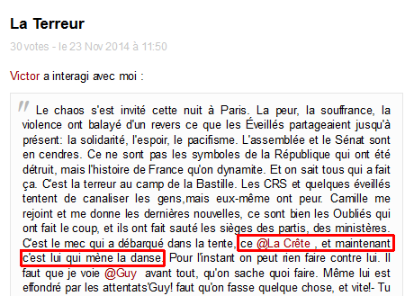 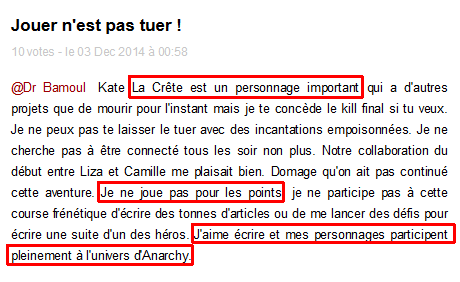

===
d'une part, l'influence sur les autres joueurs : avec trois stratégies de construction d’une influence.

1. **La première** est le travail littéraire que fait N’Dish sur le caractère de son personnage. il le dote d’une **autorité charismatique** et d’une force d’initiative en mentionnant d’autres personnages dans ses billets afin qu’ils le suivent dans ses actions. Cela lui permet de se donner **une visibilité** d’où résulte son influence narrative.
2. **La seconde stratégie** est le travail de N’Dish sur **l’impact citationnel** de son personnage, à travers sa capacité à relayer de l’information, mais aussi sa capacité à demander aux autres de relayer ses propres actions (en particulier les organes de «presse indépendante» comme FranceBN). La Crête se constitue alors comme **un nœud narratif et informationnel**, il établit sa **notoriété** qui lui confère une influence qu’on pourrait appeler **médiatique** (à l’image des retweet sur Twitter).
3. Enfin, sa **troisième stratégie** est un travail sur la représentation de l’auteur lui-même, à travers une justification de son positionnement et la constitution d’un réseau de collaborations. C'est un travail mené sur **la figure auctoriale** et cette démarche lui permet d’instaurer sa **légitimité** sur laquelle il peut alors bâtir une **influence organisationnelle**.

_Ces diverses stratégies ont été couronnées d’un succès qu’attestent à la fois le suivi de ses initiatives narratives, la densité de ses citations et relais par d’autres joueurs ainsi qu’une reconnaissance qualitative (« maintenant, c’est lui qui mène la danse », dit l’un d’eux, Victor)._

§§§§§§§§§§§§§§§§§§§§§§§§§§§§§§§§§§§§§§§§§§§§§
#### 2. Influence sur la Rédaction

&nbsp;

<i class="fa fa-arrow-right"></i> Impact sur l'arche narrative  
<i class="fa fa-arrow-right"></i> Pouvoir d'inflexion du dispositif

===
2. Deuxièmement, l'Influence sur la Rédaction : ici il ne s'agit pas tant de l'influence de La Crête sur le récit-cadre mais plutôt du pouvoir de NDish pour infléchir le dispositif même. Bien sûr les actions de La Crête ont eu un impact certain sur l’arche narrative en influencant le fil d'Actualité. Mais l’auteur N’Dish a surtout contribué à ce que la Rédaction modifie les règles du jeu, et les modalités d'écriture de la Rédaction elle-même. Suite aux échanges entre NDish et la Rédaction, cette dernière a en effet abandonné son arche narrative globale et décidé de laisser plus de marges aux joueurs pour orienter le cours de l'histoire d'Anarchy. Cette décision a un été un tournant majeur dans l'expérience Anarchy. La décision a été prise après un bras de fer entre 1) les scénaristes d'Anarchy, attachés à garder le contrôle de l'univers, et 2) la Rédaction, les journalistes, en prise quotidienne avec les joueurs et leurs personnages. Les auteurs-joueurs étaient de plus en plus mécontents de voir leurs contributions soit passées à la trappe, soit restées marginales dans l'arche narrative suivie par la Rédaction, avec une Actualité de plus en plus déconnectées des Personnages, car écrites entre 1 et 3 jours à l'avance. Sous le lead de NDish, une poignée d'auteurs ont fait pression sur la Rédaction et menacé de quitter le jeu.

La Rédaction a fini par "changer de bord" et a relayé la pression des auteurs comme NDish et a convaincu les scénaristes, les véritable maître de l'univers, de modifier les process de production de la Rédaction avec d'une part une écriture au jour le jour, et d'autre part une arche globale adaptative au cours de l'Histoire des personnages.  

Cette inflexion du dispositif a permis de relancer la confiance entre les auteurs et la Rédaction. Et a évité leur abandon du jeu.

§§§§§§§§§§§§§§§§§§§§§§§§§§§§§§§§§§§§§§§§§§§§§
### Conclusions

&nbsp;

Une dynamique ambivalente de l'autorité, entre :
* autoritativité numérique (E. Broudoux)
* et régime d'autorité plus classique (charisme et légitimité, M. Weber)

===

On peut en conclure que l’autorité, entendue ici comme influence narrative, obéit à une dynamique ambivalente. D’un côté, elle semble se rattacher aux **pratiques autoritatives**, propres à l’espace numérique, par où un scripteur s’autorise lui-même et fixe les conditions de sa légitimité, adossant en quelque sorte un rôle d'éditeur: éditeur de soi-même, ou encore éditorialisatino de soi..

C’est typiquement ce dont témoigne le bras de fer de La Crête avec la Rédaction. Mais d’un autre côté, les stratégies de La Crête semblent hériter de figures plus classiques de l’autorité wébérienne (notamment le charisme et la légitimité).

Comme on l’a vu avec son influence sur les autres joueurs, N’Dish utilise le charisme de sa personne pour établir peu à peu sa légitimité auprès de ses pairs.

Ainsi, loin de s’effacer dans un tel projet collaboratif, la notion d’autorité y persiste en fait sous un nouveau visage : c'est une construction hybride où se croisent des dynamiques héritées de l’imprimé et des pratiques spécifiquement digitales.

Elle nous indique qu’il faut toujours **être autorisé**, quitte à **s’autoriser soi-même**, pour exister dans l’histoire.

%%%%%%%%%%%%%%%%%%%%%%%%%%%%%%%%%%%%%%%%%%%%%
## 3. Approche dispositive

===définir ce que j'entends par cette approche

§§§§§§§§§§§§§§§§§§§§§§§§§§§§§§§§§§§§§§§§§§§§§
### préambule : sur le dispositif

&nbsp;

Du dispositif foucauldien au dispositif _anarchyque_

&nbsp;

<small>Albera F. et Tortajada M. (2011). _« Le dispositif n’existe pas ! »_  
dans François Albera et Maria Tortajada (dir.), Ciné-dispositifs: spectacles, cinéma, télévision, littérature, L’Âge d’homme, Lausanne, pp. 13-38.</small>

&nbsp;

<i class="fa fa-arrow-right"></i> dispositif transmédia d'écriture collaborative

===
Notre troisième approche s'appuie sur l'étude du dispositif. Je n'ai pas le temps ici de revenir sur la notion de dispositif qui est définie successivement par Foucault, Agamben ou encore Bruno Bachimont. Ces travaux fameux mettent en avant le caractère **déterministe** du dispositif, or nous aimerions considérer le dispositif, numériques tout du moins, comme **suscitant** des pratiques, plutôt que ne les déterminant.

C'est pourquoi nous avons voulu nous écarter un peu de ces travaux, et il nous a semblé plus productif de favoriser une étude empirique, ancrée dans notre corpus pour en tirer une analyse ou une typologie du dispositif, propre à notre terrain.

On reprend ainsi la démarche de François Albera et Maria Tortajada sur le dispositif cinématographique, mais en considérant ici **un dispositif transmédia d'écriture collaborative**.

§§§§§§§§§§§§§§§§§§§§§§§§§§§§§§§§§§§§§§§§§§§§§

<table class="tg2">
  <tr>
    <th class="tg-s6z2"></th>
    <th class="tg-c9cr">Dimensions</th>
    <th class="tg-jogk">soit dans Anarchy</th>
  </tr>
  <tr>
    <td class="tg-baqh">1</td>
    <td class="tg-yw4l"><strong>Environnement-support</strong> (Zacklad)</td>
    <td class="tg-yw4l">Matériel, applicatifs, système d’exploitation et infrastructure réseau</td>
  </tr>
  <tr>
    <td class="tg-baqh">2</td>
    <td class="tg-yw4l"><strong>Représentations</strong> _Enonciation éditoriale_ (Jeanneret & Souchier) </td>
    <td class="tg-yw4l">Agencement des différents modules dans le site ou dans l'application mobile : mise en espace, aspects éditoriaux, points d'entrées dans les contenus et modalités de navigation </td>
  </tr>
  <tr>
    <td class="tg-baqh">3</td>
    <td class="tg-yw4l"><strong>Cercle magique</strong> (Huitzinga)</td>
    <td class="tg-yw4l">Règles du jeu et leurs expressions dans l'interfaces (les points, les votes, les injonctions à contribuer), mais aussi leur encodage dans les dimensions techniques</td>
  </tr>
  <tr>
    <td class="tg-baqh">4</td>
    <td class="tg-yw4l"><strong>Acteurs</strong></td>
    <td class="tg-yw4l">L'équipe de rédaction, son organisation spatiale, ses process de rédaction/validation, les joueurs</td>
  </tr>
</table>

<small>Tableau : _Les 4 dimensions du dispositif transmédia_</small>

===
Dans ce tableau, nous identifions 4 dimensions qui ne s'agencent pas entre elles de façon hiérarchique, mais de façon transversale et équivalente.

* La première concerne l'infrastructure technique sur laquelle l'expérience Anarchy a reposé pendant 6 semaines. On retrouve ici l’environnement-support de Manuel Zacklad.
* La seconde concerne les représentations, cad l'affichage visuel des données aux travers de différents modules fonctionnels, et dont l'agencement constitue les interfaces du site et de l'application mobile. Ces représentations sont l'interface interactive et performative entre les acteurs et les données.
* la troisième est celle qui a retenu plus particulièrement notre attention comme composante principale de l'autorité dispositive. C’est le cercle magique en référence aux travaux de Huitzinga sur la théorie du jeu. Dans ce cercle nous incluons les règles du jeu, et leurs expressions dans l'interface (les points, les votes, les injonctions à contribuer), mais aussi leur encodage dans les dimensions techniques.
* La quatrième concerne les acteurs, _participant_ eux-aussi du dispositif dans la mesure où ils s'agencent également dans l'espace, celui physique de la Rédaction, mais aussi dans l'environnement numérique, régissant les modalités d'actions de chacun.

§§§§§§§§§§§§§§§§§§§§§§§§§§§§§§§§§§§§§§§§§§§§§
### _&laquo;Action dispositive&raquo;_

<small>Louise Merzeau (2013). _Éditorialisation collaborative d’un événement._  
Communication et organisation, (43), 105–122.  
http://doi.org/10.4000/communicationorganisation.4158</small>

&nbsp;

<i class="fa fa-arrow-right"></i> le dispositif comme **une dynamique**

<i class="fa fa-arrow-right"></i> le dispositif comme **conditions de possibilité de la production de la fiction**

===
Dans cette typologie, on retrouve la notion d'**action dispositive** décrite par Louise Merzeau lorsqu'elle identifie le dispositif comme une dynamique (Merzeau, 2013) plutôt qu'un support. On pourrait dans notre cas parler d'_écriture dispositive_. C'est-à-dire dans Anarchy, la dynamique qui régit la production de la fiction par ses différents acteurs.
En ce sens, le dispositif n'est pas une simple armature soutenant la fiction, mais relève davantage des **conditions de possibilité de la production de la fiction**.

§§§§§§§§§§§§§§§§§§§§§§§§§§§§§§§§§§§§§§§§§§§§§
### Autorité dispositive

> la série de contraintes générées par le dispositif que l'utilisateur prend en compte dans son usage.

&nbsp;

<i class="fa fa-arrow-right"></i> une autorité _bienveillante_

<i class="fa fa-arrow-right"></i> une autorité comme **prédisposition des modalités d'écriture de la fiction**

===
Les quatres dimensions décrites précédemment constituent ensemble une série de contraintes, qui ne relève pas seulement de l’énonciation éditoriale, au sens de Souchier.

Nous appelons _autorité dispositive_ : cette **série de contraintes** générées par le dispositif, et que l'utilisateur prend en compte dans son usage.

Cette prise en compte ne consiste pas nécessairement à en épouser la forme et à s'y conformer, mais suppose de considérer le dispositif, de l'apprécier et d'en exploiter les contraintes qui _prédisposent_ l’usage, et qui l'accueillent, cad en fait qui accueille le contournement, le détournement, l’optimisation, etc.

Finalement, il s'agit bien d'une prédisposition des modalités d'écriture de la fiction c’est-à-dire en particulier ici des modalités de collaboration, des modalités temporelles, des modalités environnementales, etc.

§§§§§§§§§§§§§§§§§§§§§§§§§§§§§§§§§§§§§§§§§§§§§
### Autoritativité collective

===
Ainsi, la dimension du Cercle Magique est particulièrement importante puisque c'est cette dimension qui, dans cet espace ainsi agencé, ouvre un espace de négociation entre les auteurs et le dispositif. C'est dans ce cercle, alors qu'il est projeté ou qu'il se projette dans cette dimension, que l'auteur de personnage, le contributeur à l'univers Anarchy, peut reprendre un tant soit peu la maîtrise de l'espace et de l’environnement de publication.

Dans les différents rapports de force qui ont émergés au cours de l’expérience Anarchy, celui qui liait la Rédaction avec les auteurs est le plus emblématique de ce qui caractérise un dispositif collaboratif d’éditorialisation, en cela qu’il a mis en évidence la capacité d’une communauté d’auteurs à influer pas seulement sur la fiction et l’univers général, mais aussi sur les règles du jeu et donc sur le dispositif lui-même.

Mais c’est bien le collectif ici qui compte et qui est susceptible d’infléchir les règles du jeu. De nombreux exemples relatifs aux plateformes et services grand public viennent vérifier cette assertion. Pour n’en citer qu’un : la marche arrière de Facebook sur sa mesure anti-pseudonyme (real-name policy) qui a généré une levée de bouclier notamment de la communauté LGBT et des défenseurs des libertés et de la vie privée.

Dans Anarchy, il n’aura suffi que de 4-5 semaines pour qu’un groupe informel d’auteurs sous pseudonyme se constitue en un collectif reconnu et écouté par la Rédaction et à fortiori par les producteurs de l’expérience.

Pour comprendre comment cela a été rendu possible, il faut retourner au dispositif.

§§§§§§§§§§§§§§§§§§§§§§§§§§§§§§§§§§§§§§§§§§§§§
### Bienveillance dispositive

&nbsp;

<small>Emmanuel Belin (1999). _De la bienveillance dispositive_  
Hermès, (25), 243–259.  
http://documents.irevues.inist.fr/handle/2042/14700</small>

===

Le dispositif Anarchy comme tout dispositif émet bien une certaine autorité puisqu'il impose à l'utilisateur d'adapter ses modalités d'actions. Mais cette autorité fait davantage penser à de la **bienveillance** que du **déterminisme**. _Bienveillance dispositive_ donc, terme que je reprends à Louise Merzeau, elle-même citant le texte d'Emmanuel Belin : De la bienveillance dispositive (1999).

Cette approche sur le dispositif permet de revisiter une vision trop foucaldienne du dispositif dont il est nécessaire de nuancer le déterminisme.

Cela aura été en tout cas une des clés du succès de la participation sur Anarchy.

%%%%%%%%%%%%%%%%%%%%%%%%%%%%%%%%%%%%%%%%%%%%%
### Articulation des trois autorités

&nbsp;

Autorité    | Objet | Transaction
:--|:--|:--
dispositive |  agencement de l'espace           | le dispositif autorise les auteurs
narrative   |  écriture dans _(et de)_ l'espace | les auteurs s'autorisent et autorisent leur pairs
topologique |  représentation de l'espace       | la spatialité manifeste l'autorité

<!--

Autorité    |   | Objet | Acteur ?
:--|:--|:--|:--
dispositive | <i class="fa fa-arrow-right"></i>  | le dispositif agence l'espace informationnel | il autorise les auteurs
narrative   | <i class="fa fa-arrow-right"></i>  | les auteurs écrivent dans _(et de)_ l'espace et agence la fiction | ils autorisent leurs pairs
topologique | <i class="fa fa-arrow-right"></i>  | mise en évidence de l'état de fait créé par cette double dynamique autoritative/autoritaire/d'autorité | représentation de l'espace
-->

===
Nous voici donc avec 3 autorités, toute maintenant un lien étroit avec l'espace sur lequel elles agissent.

* L’autorité dispositive consiste en un agencement de l’espace : le dispositif autorise les auteurs
* L’autorité narrative consiste en une écriture **dans** l’espace et **de** l’espace : dans lequel les auteurs s’autorisent et autorisent leurs pairs
  * Ces deux autorités se combinent, il ne s’agit pas selon nous d’un transfert d’autorité pour répondre à une question posée hier.
* L’autorité topologique finalement consiste en une représentation de l’espace ainsi écrit et agencé. La spatialité de ses éléments n’est alors que la manifestation ou le reflet des deux autorités précédentes.

%%%%%%%%%%%%%%%%%%%%%%%%%%%%%%%%%%%%%%%%%%%%%

## Merci !
&nbsp;

&nbsp;

&nbsp; | contacts
:--|:--
**Nicolas Sauret** | _nicolas.sauret@umontreal.ca @nicolasauret_
**Ariane Mayer** | _ariane0mayer@gmail.com_
**Carnet de recherche** | [_nicolassauret.net/behindanarchy/_](http://nicolassauret.net/behindanarchy/)

&nbsp;

 <!-- .element: class="logo" -->

<!-- <small>Figures et expériences de l'autorité en littérature 3e colloque étudiant du Dllf - Udem - 19 & 20 janvier 2017</small> -->
