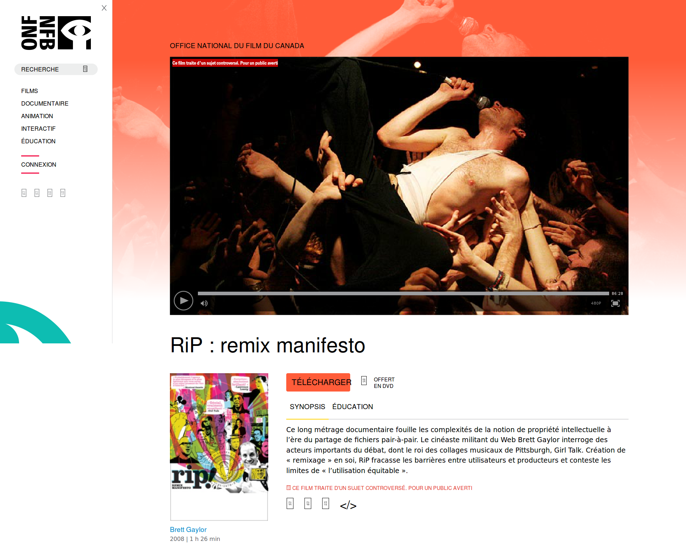
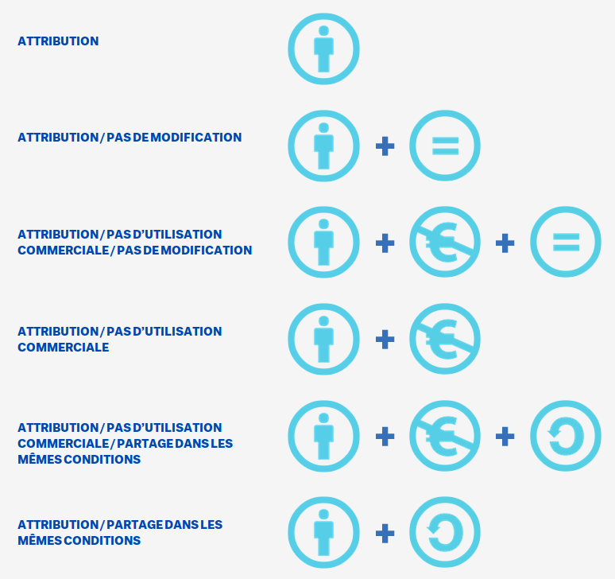

## Apologie de la dispersion
&nbsp;

Nicolas Sauret  

colloque étudiant du département de littératures et de langues du monde  
<small>« Zones de dispersion : errance et identité »  
14-16 décembre 2016</small>

%%%%%%%%%%%%%%%%%%%%%%%%%%%%%%%%%%%%%%%%%%%%%
### 1. de l'écriture
---
### 2. de la circulation
---
### 3. de l'appropriation

===

J'interviens ici juste avant Servanne Monjour qui nous parlera plus précisement d'un corpus littéraire sur lequel nous travaillons ensemble. C'est un corpus collectif, pour lequel le numérique a joué un rôle déterminant dans sa constitution au fil des années.

Ma présentation souhaite dresser un paysage rapide des conditions intellectuelles et culturelles de sa réalisation, où justement la dispersion semble jouer un rôle premier, non pas la dispersion des hommes ou des identités, mais celle des idées.

Ces conditions culturelles s'inscrivent dans un contexte technique favorable à l'écriture, à la circulation et à l'appropriation. Nous verrons ensuite en quoi ces trois vecteurs des idées le sont de la diversité.

%%%%%%%%%%%%%%%%%%%%%%%%%%%%%%%%%%%%%%%%%%%%%
## 1. de l'écriture
§§§§§§§§§§§§§§§§§§§§§§§§§§§§§§§§§§§§§§§§§§§§§

  

[http://www.onf.ca/film/rip_remix_manifesto](http://www.onf.ca/film/rip_remix_manifesto) (from 3:23)

Cas d'étude des Creative Commons : [https://wiki.creativecommons.org/wiki/Case_Studies/RIP:_A_Remix_Manifesto](https://wiki.creativecommons.org/wiki/Case_Studies/RIP:_A_Remix_Manifesto)

===

* Je voudrais commencer avec la projection de 3 minutes de vidéos, je sais c'est beaucoup dans une présentation de 15 minutes, mais c'est une vidéo assez emblématique finalement pour le propos que je tiens.

§§§§§§§§§§§§§§§§§§§§§§§§§§§§§§§§§§§§§§§§§§§§§

  

<small>capture: [http://www.onf.ca/film/rip_remix_manifesto](http://www.onf.ca/film/rip_remix_manifesto)</small>

===

* De cet extrait, retenons pour le moment deux choses :
  * que les pratiques de mashup se sont répandues malgré leur caractère illégales, et que par leur massification, elles sont venues questionner profondément les modèles culturels, économiques, juridiques et politiques qui régissent la création et l'innovation. Le mashup est devenu en quelque sorte le fer de lance d'un nouveau paradigme culturel qui entend renverser l'ancien paradigme.
  * Quel est cet ancien paradigme ? Un paradigme basé sur le copyright, une conception très restrictive du droit d'auteur et de la propriété intellectuelle qui considère que l'intérêt du détenteur des droits d'une oeuvre réside dans la protection de cette oeuvre contre toute utilisation; Le copyright, c'est-à-dire le "droit à la copie" peut alors être vendu au compte-goutte, afin d'entretenir une rareté lucrative.
  * Au contraire, le modèle inverse, le copyleft est une conception plus ouverte du droit d'auteur qui considère que l'intérêt général (et par extension l'intérêt des auteurs) réside dans le partage des oeuvres pour toute utilisation. Le copyleft revient donc pour l'auteur ou le détenteur des droits à céder son droit à la copie à tout à chacun. Sans pour autant abandonner la paternité des oeuvres.

§§§§§§§§§§§§§§§§§§§§§§§§§§§§§§§§§§§§§§§§§§§§§

> «&nbsp;Un mashup (littéralement _«purée»_) est un mélange d'images et de sons numériques, un peu dans la tradition du sample. C’est un art du recyclage, du remploi d’images empruntées et tournées par d’autres.&nbsp;»

Source : Wikipedia, _Mashup (vidéo)_, 8/12/2016

> «&nbsp;Le mashup relève avant tout d’un état d’esprit. Intimement lié à la nature même d'Internet, à son histoire, ses usages, c’est un pilier du Web participatif.&nbsp;»

===

Wikipedia, définit le mashup comme un mélange, un recyclage, un remploi. Et sans surprise, indique qu'effectivement, la pratique du mashup est "intimement lié à la nature même d'Internet", on y reviendra, et introduit ici la notion de participation.

§§§§§§§§§§§§§§§§§§§§§§§§§§§§§§§§§§§§§§§§§§§§§

<blockquote style="font-size:0.85em;">«&nbsp;Le mashup implique la réutilisation et le remix d’œuvre d’arts, de contenus, et/ou de datas à des fins qui n’étaient pas initialement prévues ou même imaginées par les créateurs de ces œuvres.&nbsp;»</blockquote>

Brian Lamb, _Dr. Mashup; or, Why Educators Should Stop Worrying And Love The Remix_, 2007

<blockquote style="font-size:0.85em;">«&nbsp;Des éléments de réutilisation ont toujours été présents dans la création, l'emprunt pouvant être formulé en terme de traduction ou d'influence.&nbsp;»</blockquote>

<blockquote style="font-size:0.85em;">«&nbsp;Les travaux artistiques et académiques s'appuient toujours sur le travail des autres&nbsp;»</blockquote>

===

Dans un article intitulé _Dr. Mashup; or, Why Educators Should Stop Worrying And Love The Remix_, Brian Lamb définit également le mashup, et ajoute à la définition de wikipedia un élément important à mon sens : la réutilisation à des fins non prévues "ou même imaginées" par les créateurs. Les esprits les plus solidement attachés à la cause des éditeurs pourraient déceler là quelque chose de l'ordre du détournement, du hijacking, peut-être même de terrorisme intellectuel ?

Heureusement Brian Lamb nous invite à dédramatiser une telle perspective en nous rappelant que la réutilisation est pratique courante dans les milieux créatifs, voir pour certains domaines intellectuels, une pratique vitale.

Autrement dit, il n'y pas d'originalité pure, c'est un mythe, cela semble une évidence, même dans un département de littérature, mais ce mythe continue d'être le principe cardinal de la propriété intellectuelle telle qu'elle s'applique encore aujourd'hui.

<!--

[http://www.ted.com/talks/kirby_ferguson_embrace_the_remix.html](http://www.ted.com/talks/kirby_ferguson_embrace_the_remix.html)

Bob Dylan emprunte à Woodie Guthrie
Steve Jobs introduit l'iphone en 2007 avec cette grande révolution : le multitouch.
Pourtant 1 an avant,  Jeff Han présente le multitouch dans une conf à ted (qui lui même avoue que la techno n'est pas nouvelle et qu'elle évolue depuis bientôt dix ans) -->

§§§§§§§§§§§§§§§§§§§§§§§§§§§§§§§§§§§§§§§§§§§§§

> «&nbsp;L'appropriation, l'imitation, la citation, l'allusion, et la collaboration sublimée, consistent en une sorte de _sine qua non_ de l'acte créatif [...]&nbsp;»

Jonathan Lethem. _« The Exctasy of Influence »_. Harper’s Magazine, février 2007, section Criticism, 59‑71.

===

Jonathan Lethem va un peu plus loin dans son article _The Exctasy of Influence_, puisqu'il inverse l'idée même de la création, et l'assujetti au recyclage, de fragments ou d'idées, comme une condition sine qua non.

Quel est alors le principe créatif d'une telle création ? en quoi consiste l'acte créatif si ce n'est le recyclage de choses existantes ? Le principe est l'association d'éléments entre eux : des contenus, des données, des formes, des idées, et ces associations génèrent **un fort potentiel créatif**.

§§§§§§§§§§§§§§§§§§§§§§§§§§§§§§§§§§§§§§§§§§§§§

## (ré)écrire

### 1 + 1 = 3

&nbsp;

<blockquote style="font-size:0.85em;">"that which lies here in ruins, the highly significant fragment, the remnant, is, in fact, the finest material in Baroque creation. For it is common practice in the literature of the baroque to pile up fragments ceaselessly, whitout any strict idea of a goal... In the unremitting expectation of a miracle"</blockquote>

Walter Benjamin, _The Origin of German Tragic Drama_, 1998 (1963), p178.

===

C'est le principe du montage : l'association de plans cinématographiques n'est pas une simple addition de plan, c'est véritablement l'écriture d'une nouvelle signification.

Il y a dans ce recyclage de fragments un potentiel créatif, que Walter Benjamin appelait, en parlant lui aussi d'association de fragments, "the unremitting expectation of a miracle", l'attente implacable d'un miracle. C'est dans _Origine du drame baroque allemand_, dont je n'ai trouvé qu'une version anglaise, mais nous sommes en littérature comparée après tout, comparons.

Il s'agit donc d'écriture, d'une écriture libérée et décomplexée vis à vis de la propriété intellectuelle, pour laquelle la réécriture est aussi naturelle, et saine, et essentielle que le partage d'un livre.

> "that which lies here in ruins, the highly significant fragment, the remnant, is, in fact, the finest material in Baroque creation. For it is common practice in the literature of the baroque to pile up fragments ceaselessly, whitout any strict idea of a goal... In the unremitting expectation of a miracle"

<!--

[http://www.widrichfilm.com/fastfilm/](http://www.widrichfilm.com/fastfilm/) -->

%%%%%%%%%%%%%%%%%%%%%%%%%%%%%%%%%%%%%%%%%%%%%
## 2. de la circulation

===

C'est la circulation des idées qui est en jeu. Comprenez bien que le mashup n'est qu'un fer de lance dans cette culture émergente, et que dans la nouvelle chaîne de valeur que cette culture sous-tend, la circulation des idées prévaut sur la protection des idées.

Cette chaine de valeur n'est écrite dans aucune loi.
§§§§§§§§§§§§§§§§§§§§§§§§§§§§§§§§§§§§§§§§§§§§§

> Code is law.

Lawrence Lessig, _Code is Law. On Liberty in Cyberspace_, Harvard Magazine, 01-01-2000.

===

Elle est par contre écrite dans le code. Or comme le disait Lawrence Lessig :

> Code is law.

Cette énoncé est performatif, et semble avoir valeur de Constitution, ou de Déclaration, pour une nouvelle ère du savoir. Ca n'est pas un hasard s'il est publié le 1er janvier de l'an 2000. Code is law annonce les règles qui vont régir le 21eme siècle.

§§§§§§§§§§§§§§§§§§§§§§§§§§§§§§§§§§§§§§§§§§§§§

### TCP

Transmission Control Protocol

===

Ces règles sont notamment celles de deux protocoles de communication qui forme le web tel qu'on le connait.

D'une part, la couche de communication entre machine : le TCP/IP, ou le Transmission Control Protocol

§§§§§§§§§§§§§§§§§§§§§§§§§§§§§§§§§§§§§§§§§§§§§

### HTTP

Hypertext Transfer Protocol

===

Et le HTTP : ou Hypertext Transfer Protocol qui assure cette fois-ci la couche de communication entre un  navigateur et un serveur HTTP dont le rôle est de servir des ressources web.

§§§§§§§§§§§§§§§§§§§§§§§§§§§§§§§§§§§§§§§§§§§§§

===

Ces deux couches sont imbriquées l'une dans l'autre, et elles-mêmes sont imbriquées dans d'autres couches de plus bas niveaux.

Qu'est ce qui a changé avec ce réseau universel de machines qu'est Internet et ce réseau universel de documents qu'est le web ?

Car le remix, ou le mashup existaient bien évidemment avant le web et Internet. Les pratiques de recyclage ou de réécriture également.

§§§§§§§§§§§§§§§§§§§§§§§§§§§§§§§§§§§§§§§§§§§§§
### http://inter.net/principes

* adressage universel
* accessibilité des ressources
* interopérabilité
* décentralisation
* ouverture des codes, des protocoles,

===

Ce qui a changé, c'est que ces protocoles ont intégré dans leurs principes fondateurs un adressage universel de toute information. Tout média, toute information, toute donnée est susceptible sur le web d'être identifiée, extraite, copiée, associée, partagée, détournée, et devenir finalement une ressource et une matière première pour un nouveau mashup.

par ailleurs, autre principe fondateur de ces protocoles, c'est l'accès ouvert, le partage et l'appropriation, d'une part des contenus, mais aussi des outils de publications et de navigation, ainsi que de leurs langages informatiques. Ceci est très important.

Il faut se rappeler que Gutemberg a été dépossédé de son invention par son financeur Johann Fust, qui s'est chargé de la faire fructifier. L'histoire retient malgré tout la paternité de Gutemberg.

Et il en est de même pour les inventeurs du web (Tim berners-lee et Roger Caillau) qui ont tout de suite compris l'intérêt de laisser leur invention ouverte et appropriable par tous.

§§§§§§§§§§§§§§§§§§§§§§§§§§§§§§§§§§§§§§§§§§§§§

===

Le web a ainsi permis de généraliser les pratiques de remix à toute sorte de contenus.

Le copier-coller est devenu une action si évidente, si banale qu'on ne se rend plus compte à quel point elle a envahit notre production culturelle au sens large.

C'est une action en apparence anodine mais qui a le mérite de favoriser la circulation des connaissances, d'une ressource publique à un carnet personnel, d'une communauté à une autre, d'un format propriétaire à un format ouvert et partageable. Le Copier-coller hacke, sélectionne, assemble, réécrit. Et ce, sans priver autrui de la ressource originale.

Mais l'infrastructure n'est pas suffisante pour assurer le partage, il faut encore protéger ce principe contre les enclosures, cad une appropriation exclusive des biens et ressources : autrement dit contre les dynamiques capitalistes.

§§§§§§§§§§§§§§§§§§§§§§§§§§§§§§§§§§§§§§§§§§§§§
### Open Source

<!--  -->

<a title="Par René Mérou [h(at)es.gnu.org] and this list of authors related to the icons in http://es.gnu.org/~reneme/fsmap/fsmap-contents.svg : Rubén Rodríguez Pérez, Sun Microsystems, Hitflip team, Ricardo Fernandez Fuentes, David Vignoni, User: Aurelio A. Heckert, (Larry Ewing, Simon Budig and Anja Gerwinski), Agnieszka &quot;pixelgirl&quot; Czajkowska, Frédéric Bellaiche, Sven (Wikipedia), Everaldo Coelho, Ruud Kuin, Nicolas P. Rougier, The Oxygen Team, The GIMP art/developer team, David Šebík, Gryn Frøiland and Håvard Frøiland, Scribus team, Yug, Tango-artists, GNUX Art, &#039;Cathbard Druid&#039;, Joshua &quot;Jag&quot; Ginsberg and the Apache Software Fundation. For this and the Gnome theme extras follow that link for more details. (http://es.gnu.org/~reneme/fsmap/fr/fsmap-fr-w.svg) [GFDL (http://www.gnu.org/copyleft/fdl.html) ou CC BY-SA 3.0 (http://creativecommons.org/licenses/by-sa/3.0)], via Wikimedia Commons" href="https://commons.wikimedia.org/wiki/File%3ACarte_conceptuelle_du_logiciel_libre.svg"></a> <small>Carte conceptuelle du logiciel libre, par René Mérou [sur Wikipédia](https://fr.wikipedia.org/wiki/Logiciel_libre)</small>

===

A partir des années 60, alors que les chercheurs et ingénieurs en informatique partagent ouvertement leurs codes et connaissances pour progresser ensemble, AT&T, alors un acteur majeur de l'innovation informatique, invente la propriété du code, cad le code et le logiciel propriétaire, et impose à ses ingénieurs de ne plus partager leur code.

En réaction à cet enclosure des connaissances et à la fermeture des codes sources, le mouvement Open Source imagine dès les années 70 ce système de copyleft et l'implémente dans une série de licence protégeant le code informatique non pas de son utilisation (rien que le dire est une abbération), mais de la propriétarisation.
§§§§§§§§§§§§§§§§§§§§§§§§§§§§§§§§§§§§§§§§§§§§§
### Creative Commons
<!--  -->
<!--  -->

<small>Les différentes licences Creative Commons, sur [creativecommons.fr](https://creativecommons.fr)</small>

===

Ce fut l'idée 30 ans plus tard des creatives commons qui ont implémenté le principe du copyleft pour "les oeuvres de l'esprit", entendez : _contenus culturels_. Cela permet à tout auteur, créateur, amateur, recycleur, de déclarer une fois pour toute ses contenus comme partageable et réutilisable.

Nous avons donc un framework technique vecteur de partage, un framework juridique vecteur de partage, auxquels il faut maintenant veiller à associer des dispositifs numériques, des interfaces, des services, vecteurs d'une part de partage, mais aussi créant les conditions de possibilité de la réécriture, c'est-à-dire aussi les conditions de possibilité de l'appropriation.

%%%%%%%%%%%%%%%%%%%%%%%%%%%%%%%%%%%%%%%%%%%%%
### 3. de l'appropriation

===

Il ne reste que trop peu de temps pour développer cette troisième idée d'appropriation.

Je voudrais simplement tenter de tirer cette idée de réécriture vers les humanités et de la considérer du point de vue du chercheur.
§§§§§§§§§§§§§§§§§§§§§§§§§§§§§§§§§§§§§§§§§§§§§

### Collecter, annoter, réécrire
===

Il y a plusieurs façons de s'approprier un texte ou une idée : la collecte, l'annotation, la réécriture.

Ce sont des pratiques quotidienne du web, que ce soit les marques-pages, les tweets (gazouillis), le tagging, les hyperliens, les re-publications (Pinterest, Tumblr, etc.). A vrai dire, ces pratiques ressemblent à s'y méprendre à celles des chercheurs lorsqu'ils procèdent :

* au classement
* à l'indexation,
* à la lecture savante
* ou encore à l'interprétation.
§§§§§§§§§§§§§§§§§§§§§§§§§§§§§§§§§§§§§§§§§§§§§

### Interpréter
===

Car réécrire n'est rien moins qu'interprêter. Réécrire n'est pas juste disséminer, c'est introduire une différence. La dispersion des idées circulantes favorisent leur altération, comme s'altèrent les gènes à chaque génération. L'altération ou la mutation des gènes est la condition même de la vie, et c'est la condition même des idées. Ainsi l'appropriation n'est pas une simple **assimilation**, c'est la production d'une **bifurcation**, porteuse de nouveauté, de richesse et de diversité.

Vous retrouvez là des fragments d'idées bien connus, _la répétition_ de Deleuze, _la dissémination_ de Derrida ; Bernard Stiegler, lui,  attribue à cette activité herméneutique le pouvoir de lutter contre l'entropie de l'information. Je ne développe pas.
§§§§§§§§§§§§§§§§§§§§§§§§§§§§§§§§§§§§§§§§§§§§§

### &Eacute;ditorialiser
===

Nous essayons de penser le changement de paradigme intellectuel en terme d'éditorialisation. C'est un concept encore émergent qui porte l'idée d'écriture, d'édition et de publication continues et ouvertes. Si vous me demandez ce qu'est l'éditorialisation, une réponse possible pourrait être cette intervention.

La notion permet de penser le paysage culturel et intellectuel en devenir, dans lequel s'est inscrit le collectif d'auteurs, d'artistes, de performers dont Servanne va maintenant nous parler.

%%%%%%%%%%%%%%%%%%%%%%%%%%%%%%%%%%%%%%%%%%%%%

### à suivre !

**Servanne Monjour**  
Le collectif « GI », ou l’« *Instin* » de survie de la communauté littéraire à l’ère du numérique

&nbsp;

Merci !

<small>@nicolasauret - [nicolassauret.net](http://nicolassauret.net)</small>

